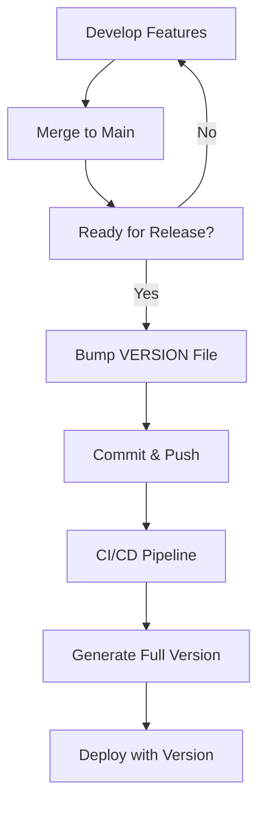

# Versioning Guide

This guide explains the semantic versioning system implemented in the fullstack Cloudflare boilerplate, including how versions are generated, managed, and used throughout the application.

## Overview

This project uses **semantic versioning (SemVer)** with automated CI/CD deployment. The system provides:

- **Manual control** over major and minor version numbers
- **Automated patch versions** via CI/CD build numbers
- **Build metadata** including Git SHA and timestamps
- **Application-wide visibility** of version information

## Version Format

Versions follow the semantic versioning specification with build metadata:

```
{MAJOR}.{MINOR}.{PATCH}+{BUILD}.{SHA}.{TIMESTAMP}
├── Manual ──┼── Manual ──┼── Auto ──┼── Auto ──┼── Auto ──┼── Auto
```

### Components

- **MAJOR** (`X.0.0`): Breaking changes, API incompatibilities
- **MINOR** (`1.X.0`): New features, backward compatible
- **PATCH** (`1.0.X`): Bug fixes, auto-incremented by CI/CD
- **BUILD** (`+X`): GitHub Actions run number
- **SHA** (`abc1234`): Short Git commit hash
- **TIMESTAMP** (`202512181430`): Build date/time (YYYYMMDDHHMM)

### Examples

| Version | Description | When Generated |
|---------|-------------|----------------|
| `1.0.0+1.abc1234.202512181400` | Initial release | First deployment |
| `1.0.1+2.def5678.202512181405` | Bug fix patch | Second deployment |
| `1.1.0+3.ghi9012.202512181410` | Feature release | After version bump |
| `2.0.0+4.jkl3456.202512181415` | Breaking changes | After major bump |

## Version File

The `VERSION` file in the repository root contains the base semantic version:

```bash
# Current base version
1.0.0
```

This file controls the MAJOR.MINOR.PATCH components. The CI/CD pipeline reads this file and appends build metadata.

## Version Bumping

### When to Bump Versions

- **PATCH** (`1.0.X`): Bug fixes, security patches, small improvements
- **MINOR** (`1.X.0`): New features, enhancements (backward compatible)
- **MAJOR** (`X.0.0`): Breaking changes, API changes, major rewrites

### How to Bump Versions

1. **Update the VERSION file**:
   ```bash
   # For a minor version bump
   echo "1.1.0" > VERSION

   # For a major version bump
   echo "2.0.0" > VERSION
   ```

2. **Commit and push**:
   ```bash
   git add VERSION
   git commit -m "chore: bump version to 1.1.0"
   git push origin main
   ```

3. **CI/CD generates full version**: `1.1.0+{BUILD}.{SHA}.{TIMESTAMP}`

### Version Bump Workflow



## CI/CD Integration

### Version Generation Process

The GitHub Actions pipeline performs these steps:

1. **Read Base Version**: Extracts `MAJOR.MINOR.PATCH` from `VERSION` file
2. **Generate Metadata**:
   - Build number: `${{ github.run_number }}`
   - Git SHA: `$(git rev-parse --short HEAD)`
   - Timestamp: `$(date +%Y%m%d%H%M)`
3. **Create Full Version**: `{BASE_VERSION}+{BUILD}.{SHA}.{TIMESTAMP}`
4. **Set Environment Variables**:
   - `BUILD_VERSION`: For backend Workers
   - `VITE_BUILD_VERSION`: For frontend Pages

### Pipeline Steps

```yaml
- name: Generate semantic version
  run: |
    BASE_VERSION=$(cat VERSION)
    echo "BUILD_VERSION=${BASE_VERSION}+${{ github.run_number }}.$(git rev-parse --short HEAD).$(date +%Y%m%d%H%M)" >> $GITHUB_ENV
```

## Application Integration

### Backend (Cloudflare Workers)

**Environment Variable Access**:
```typescript
// In Worker routes
const version = c.env.BUILD_VERSION || 'dev'
return c.json({ version })
```

**API Response Example**:
```json
{
  "name": "Fullstack Cloudflare Boilerplate API",
  "version": "1.1.0+42.abc1234.202512181430",
  "status": "online"
}
```

### Frontend (React Application)

**Environment Variable Access**:
```typescript
// In React components
const version = import.meta.env.VITE_BUILD_VERSION || 'dev'
```

**UI Display Example**:
```tsx
<footer className="app-footer">
  <span>v{version}</span>
</footer>
```

## Best Practices

### Version Management

1. **Bump Early**: Update VERSION file at the start of development cycles
2. **Use Conventional Commits**: Include version bumps in commit messages
   ```bash
   git commit -m "chore: bump version to 1.1.0"
   ```
3. **Test Versions**: Verify version display in both API and UI after deployment
4. **Document Changes**: Update changelog with version bumps

### Development Workflow

```bash
# Feature development
git checkout -b feature/new-feature
# ... develop feature ...

# Version bump for release
git checkout main
git merge feature/new-feature
echo "1.1.0" > VERSION
git add VERSION
git commit -m "chore: bump version to 1.1.0

- Add new feature X
- Improve performance Y
- Fix bug Z"
git push origin main
```

### Release Process

1. **Prepare Release Branch**: `git checkout -b release/v1.1.0`
2. **Update VERSION**: `echo "1.1.0" > VERSION`
3. **Update Documentation**: Changelog, release notes
4. **Test Deployment**: Push to staging/test environment
5. **Merge to Main**: `git checkout main && git merge release/v1.1.0`
6. **Tag Release**: `git tag v1.1.0 && git push --tags`

## Troubleshooting

### Common Issues

**Version not updating in application**:
- Check if VERSION file was committed
- Verify CI/CD pipeline ran successfully
- Check environment variable access in code

**Build metadata incorrect**:
- Ensure Git repository is clean
- Check GitHub Actions run number
- Verify timestamp format

**Version conflicts**:
- Don't modify VERSION during CI/CD runs
- Use separate commits for version bumps
- Avoid manual version editing in code

### Debugging Commands

```bash
# Check current version
cat VERSION

# See version in API
curl https://your-api.workers.dev/

# Check environment variables in CI/CD
echo $BUILD_VERSION
echo $VITE_BUILD_VERSION
```

## Migration from Other Systems

### From Manual Versioning

If migrating from hardcoded versions:

1. Create VERSION file with current version
2. Replace hardcoded versions with environment variables
3. Update build scripts to use VERSION file
4. Test version propagation

### From Git Tags

To use Git tags instead of VERSION file:

```yaml
# Alternative CI/CD approach
- name: Get version from tag
  run: |
    VERSION=$(git describe --tags --abbrev=0 2>/dev/null || echo "1.0.0")
    echo "BUILD_VERSION=${VERSION}+${{ github.run_number }}.$(git rev-parse --short HEAD).$(date +%Y%m%d%H%M)" >> $GITHUB_ENV
```

## Advanced Usage

### Custom Version Scripts

Create version management scripts:

```bash
#!/bin/bash
# bump-version.sh
current=$(cat VERSION)
major=$(echo $current | cut -d. -f1)
minor=$(echo $current | cut -d. -f2)
patch=$(echo $current | cut -d. -f3)

# Bump minor
new_version="$major.$((minor + 1)).0"
echo $new_version > VERSION
```

### Version Validation

Add version validation in CI/CD:

```yaml
- name: Validate version format
  run: |
    if ! [[ $(cat VERSION) =~ ^[0-9]+\.[0-9]+\.[0-9]+$ ]]; then
      echo "Invalid version format"
      exit 1
    fi
```

### Environment-Specific Versions

For staging/production environments:

```yaml
- name: Set environment suffix
  run: |
    if [[ "${{ github.ref }}" == "refs/heads/main" ]]; then
      SUFFIX=""
    else
      SUFFIX="-staging"
    fi
    echo "VERSION_SUFFIX=$SUFFIX" >> $GITHUB_ENV
```

This versioning system provides flexibility for manual control while maintaining automation for reliable deployments.